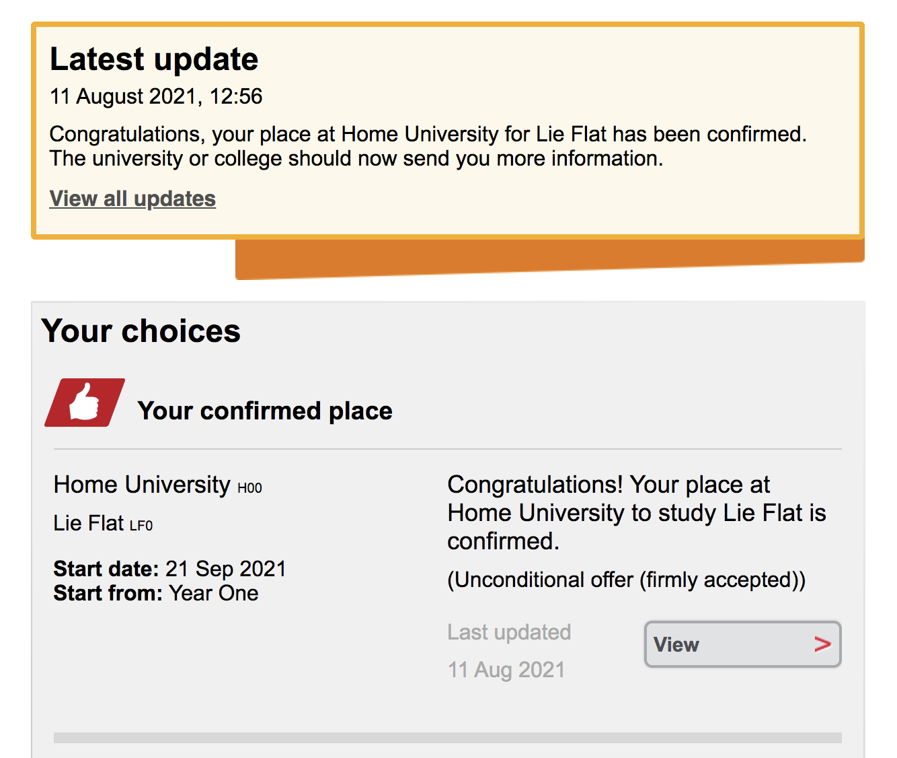

[Telegram](https://t.me/hmuni) | [Email](mailto:admin@alumni.hmuniversity.org)  
[English (UK)](README.md) | **简体中文（中国大陆）**

# 关于

- **关于**
- [什么是家里蹲学院？](Colleges.md)

家里蹲大学，又名 Home University 或 HM University，是一所虚拟全球综合性的学院制大学。  
我们希望降低学生间内卷并提升学生自身能力。我们希望成功的定义不应在于可量化的虚拟产物，而更在于学生本身。

## 如何申请家里蹲大学

去申请家里蹲大学，您不需要使用 UCAS，不需要 IELTS 或者类似成绩。您需要做的只是在此<ruby>存储库<rp>（</rp><rt>repository</rt><rp>）</rp></ruby>打开一个 issue 并且阐述您想要加入家里蹲大学。

通常地，在接受您的申请后，一封邀请信会发送至您与 GitHub 相关联的邮箱内。如果您没有收到任何邮件，但是您的申请已被批准，尝试点击 [这个链接](https://github.com/orgs/HMUniversity/invitation?via_email=1)。通常地，它会工作。如果它没有，请与我们直接取得联系。

### 从 UCAS 申请

如果你使用 UCAS 申请家里蹲大学，请确认你选择了正确的大学：

- Home University(H00) with Lie Flat(LF0).

通常地，你会在 14 个工作日内得到你的<ruby>有条件的录取通知书<rp>（</rp><rt>Conditional Offer</rt><rp>）</rp></ruby>。

在此之后，你不需要提交你的学术成绩以及其他资料至我们的<ruby>录取<rp>（</rp><rt>Admission</rt><rp>）</rp></ruby>部门。

等待 14 个工作日后，你的<ruby>有条件的录取通知书<rp>（</rp><rt>Conditional Offer</rt><rp>）</rp></ruby>会转换为<ruby>无条件的录取通知书<rp>（</rp><rt>Unconditional Offer</rt><rp>）</rp></ruby>，并且你的位置将会被确认。你的 UCAS 追踪会显示如下： 

通过这些步骤，你将成为家里蹲大学的一员。

## CAS

CAS 全称是 Confirmation of Acceptance for Studies，也就是电子录取通知书。如果您在规定的时间内缴纳押金确认入学家里蹲大学，您可以申请 CAS。每个 CAS 都有一个唯一的参考编号，包含课程信息和学生信息。如果您需要，请邮件联系我们或者打开一个 issue。

## 校友邮箱

如果您完成了家里蹲大学的任意学业，您可以申请您的校友邮箱。您需要发送一封申请邮件至 alumniapply(AT)alumni.hmuniversity.org。 其中需要包含您的 GitHub ID 以及您所需要的别名。

## 教育邮箱

没有。我们没有教育邮箱。所以想通过家里蹲大学白嫖教育特权的请自行出门左转，也不要浪费我们的时间。
